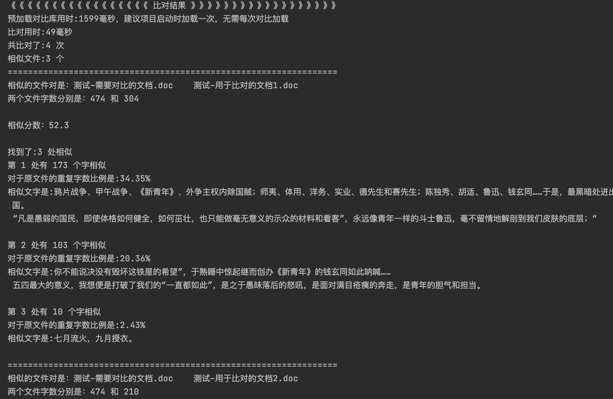
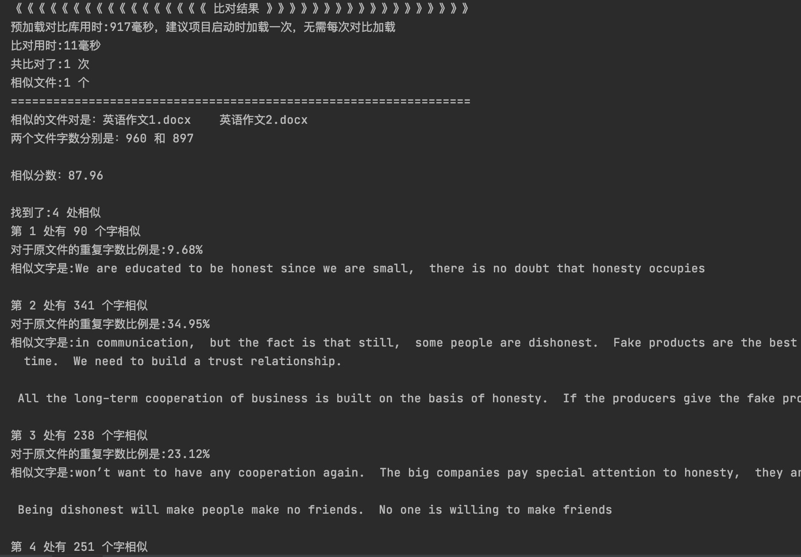

# text-analysis-demo

#### 介绍
- 一个基于java的文档查重比对sdk
- 效率高，可用于大批量文件的比对，支持doc、docx、pdf、txt等格式
- 可用于论文、标书、文档等资料的查重

#### 使用说明

详见代码样例
依赖jar包较大，第一次获取可能需要5-10分钟，如果无法下载可访问百度网盘获取

链接: https://pan.baidu.com/s/1zP2VyBf2UQYzZfVWvCnjVw 提取码: i70s

#### 示例截图
截图1:

截图2:
