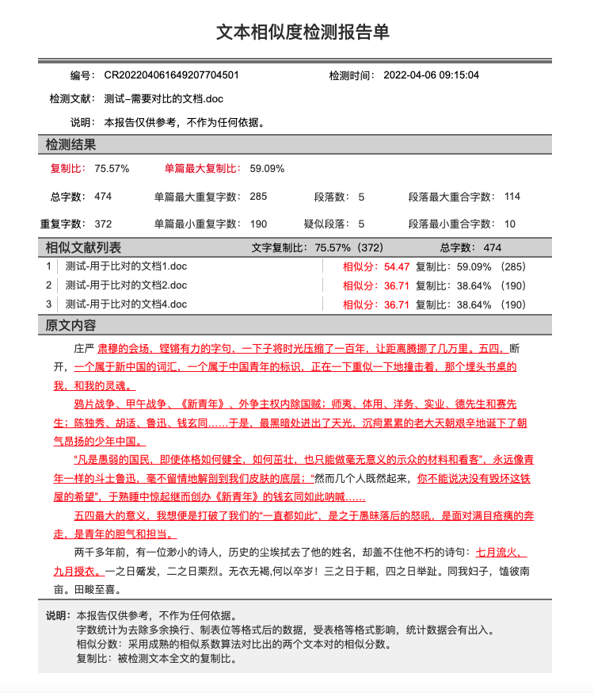
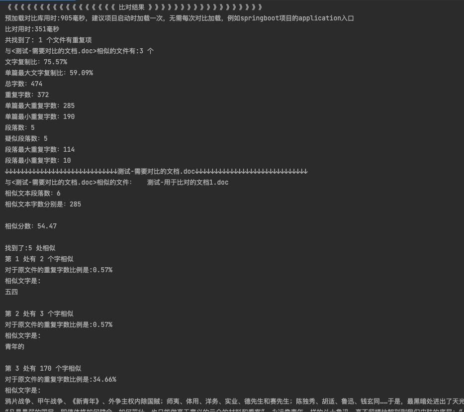
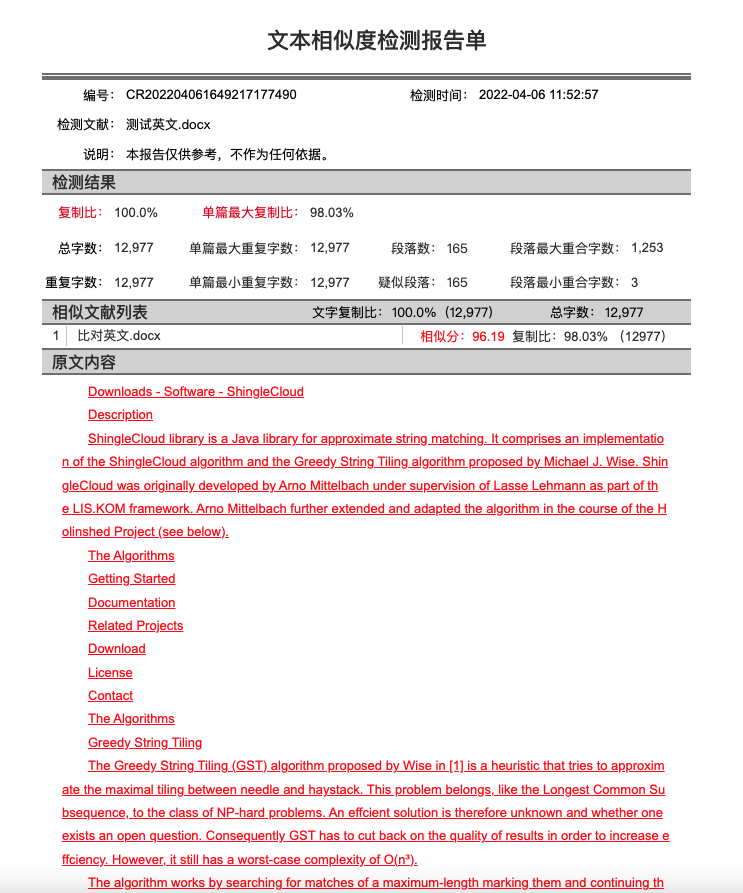
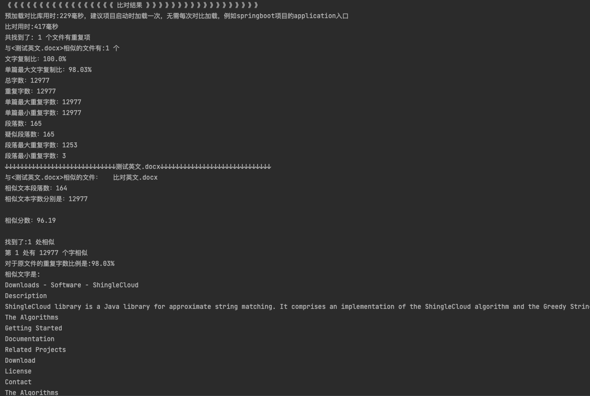

# text-analysis-demo

#### 介绍
- 一个基于java的文档查重比对sdk
- 效率高，可用于大批量文件的比对，支持doc、docx、pdf、txt等格式
- 可用于论文、标书、文档等资料的查重
- 新升级2.0.2版本
  - 增加检测报告的生成
  - 准确度提升
  - 增加了多个字段的属性信息
  - 优化预加载与查重速度
  - 开放了线程数的设置，可根据机器配置设定。详见样例工程

#### 使用说明

详见代码样例

#### 示例截图
中文文本查重1:

中文文本查重2:

英文文本查重1:

英文文本查重2:
